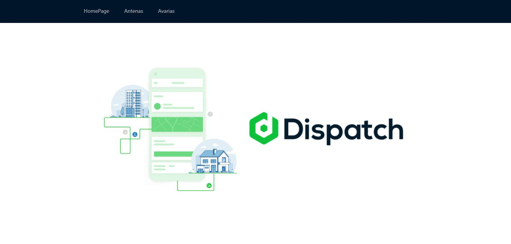
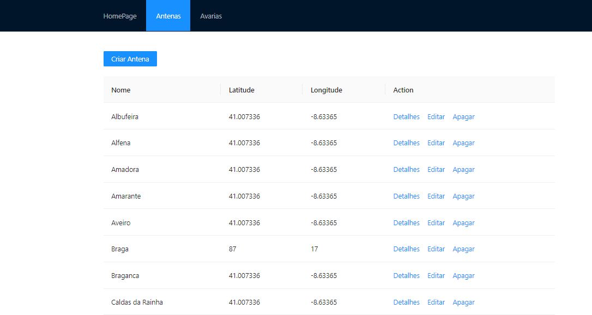
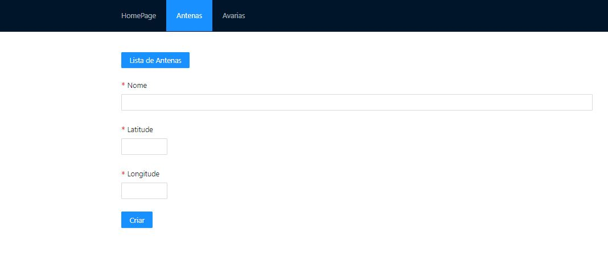
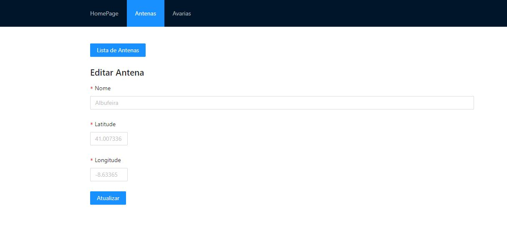
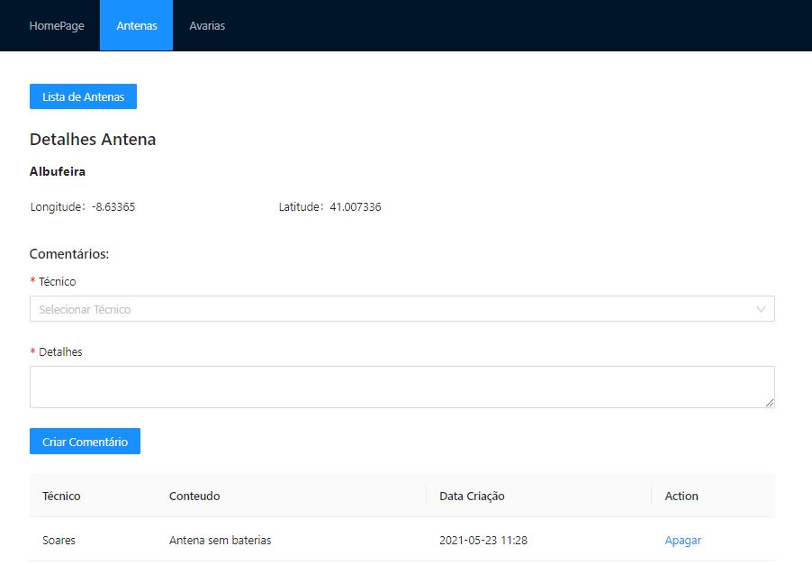
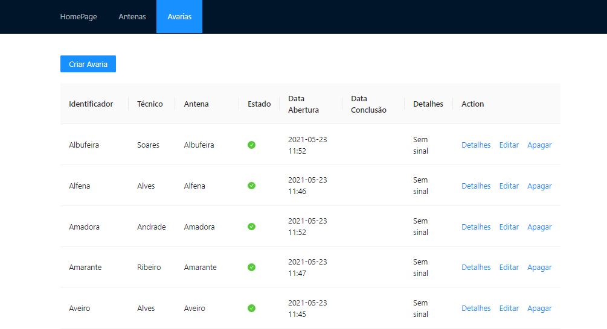
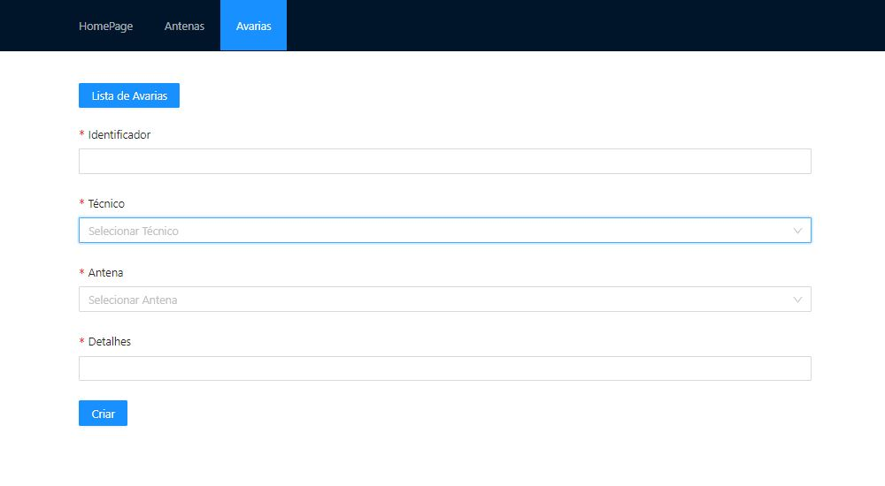
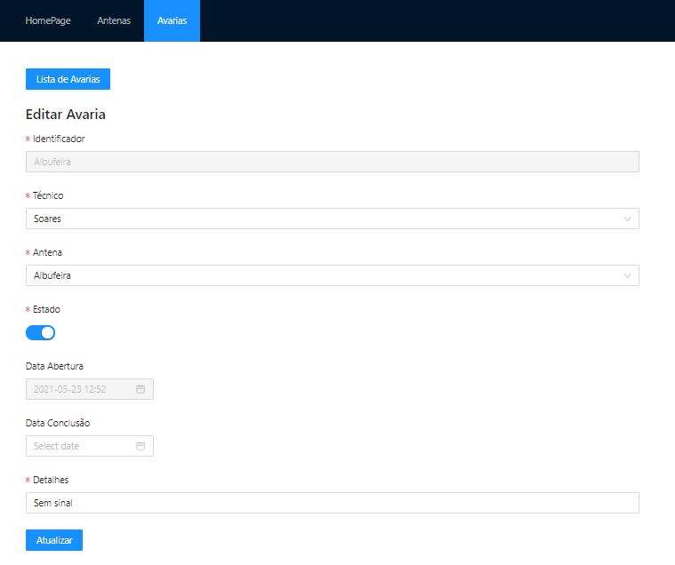
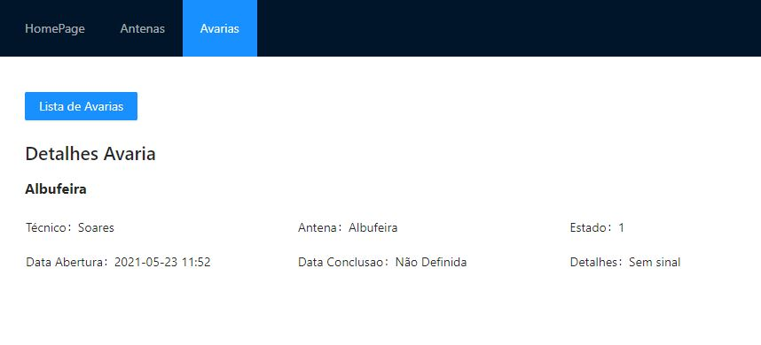

# Dispatching

Este repositório servirá para hospedar o projeto desenvolvido pelo grupo 21, formado por [Sergio Ferreira](https://github.com/SergioDanielOsorioFerreira), [Lucas Sá](https://github.com/lucassodresa), [Tiago Silva](https://github.com/TiagoSVA) da turma B, do 2º ano, da **Licenciatura de Informática** do [ISMAI](https://www.ismai.pt/pt).

Como **orientador** temos o docente [Marco Amaro Oliveira](https://github.com/MarcoAmaroOliveira).

## Breve descrição do tema

Neste trabalho está a ser desenvolvido uma API que serve para gerir avarias em antenas de telecomunicações. Um gestor de avarias pode atribuir tarefas ao técnico para resolver a avaria. Podendo o técnico consultar antenas, marcar antenas favoritas e deixar comentários sobre as antenas.

## Organização de repositório

- **Código fonte** está na [pasta src](https://github.com/gestao-avarias/dispatching-api/tree/master/src).
- Capítulos do relatório estão na [pasta doc](https://github.com/gestao-avarias/dispatching-api/tree/master/doc).

## Galeria

##### Home

|                                             |
| :-----------------------------------------: |
|  |
|               Página Inicial                |

##### Antena

|                                                 |                                                           |
| :---------------------------------------------: | :-------------------------------------------------------: |
|  |  |
|                  Página Antena                  |                    Página Criar Antena                    |

|                                                             |                                                                  |
| :---------------------------------------------------------: | :--------------------------------------------------------------: |
|  |  |
|                    Página Editar Antena                     |                      Página Detalhes Antena                      |

##### Avaria

|                                                 |                                                           |
| :---------------------------------------------: | :-------------------------------------------------------: |
|  |  |
|                  Página Avaria                  |                    Página Criar Avaria                    |

|                                                             |                                                                  |
| :---------------------------------------------------------: | :--------------------------------------------------------------: |
|  |  |
|                    Página Editar Avaria                     |                      Página Detalhes Avaria                      |

## Tecnologias

- [JSON](https://www.json.org)
- [NodeJS](https://nodejs.org)
- [Javascript](https://developer.mozilla.org/en-US/docs/Web/JavaScript)
- [OpenAPI 3.0](https://swagger.io)

### Frameworks e Bibliotecas

- NodeJS
- Swagger
- React
- Ant Design

## Relatório

### Apresentação do projeto

- Capítulo 1: [Apresentação do projeto](doc/c1.md)

### Interface de utilizador

- Capítulo 2: [Protótipo da interface de utilizador e sitemap](doc/c2.md)

### Produto

- Capítulo 3: [Produto](doc/c3.md)

### Apresentação

- Capítulo 4: [Apresentação](doc/c4.md)

## Grupo 21

- **Orientador** Marco Amaro Oliveira [@MarcoOliveira](https://github.com/marcoamarooliveira)
- Lucas Sá [@LucasSá](https://github.com/lucassodresa)
- Sérgio Ferreira [@SérgioFerreira](https://github.com/SergioDanielOsorioFerreira)
- Tiago Silva [@TiagoSilva](https://github.com/TiagoSva)
