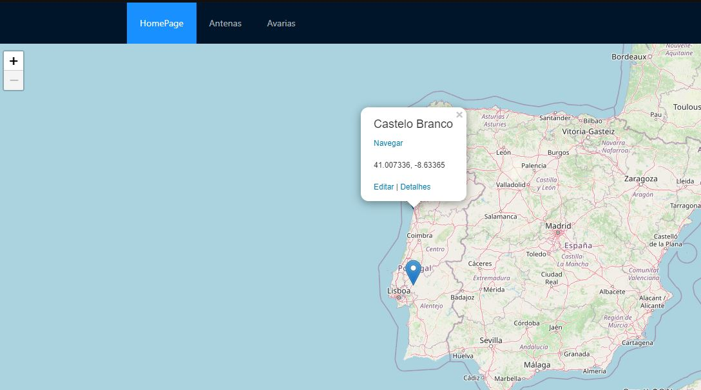
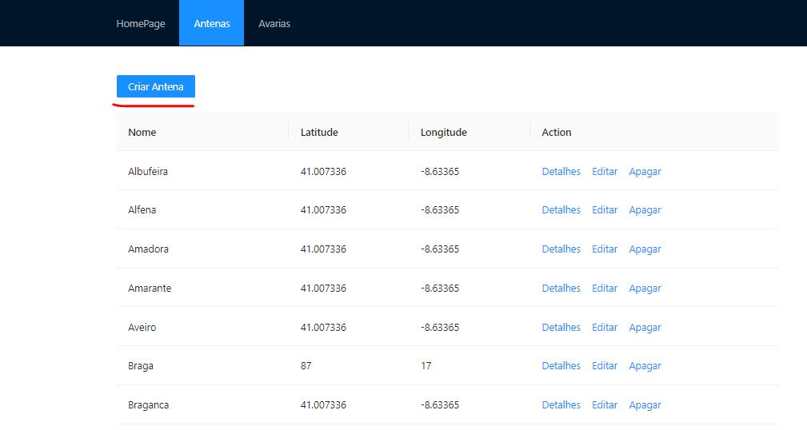
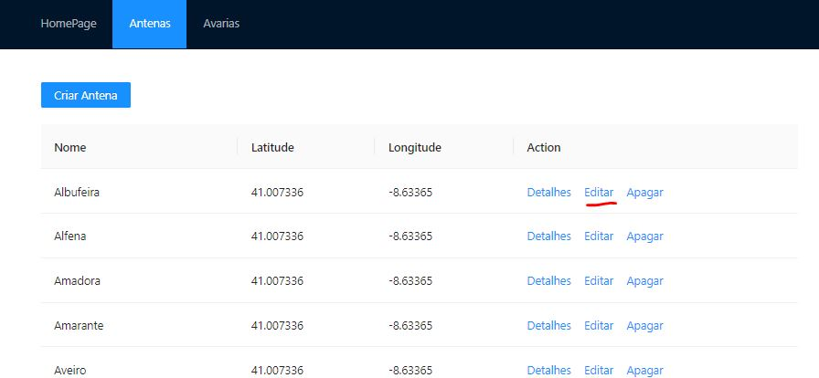
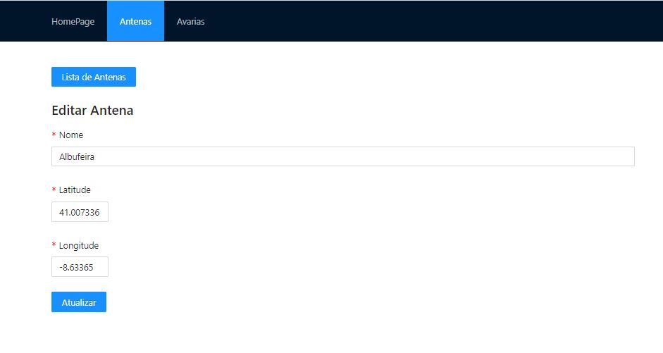
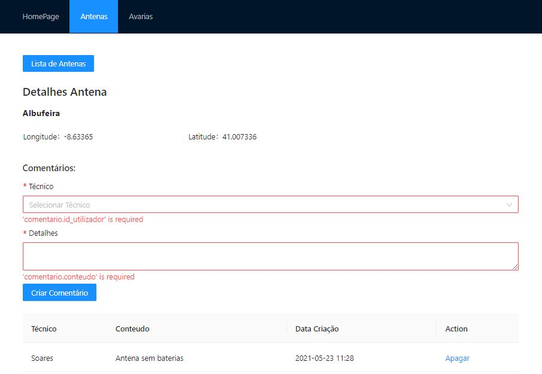
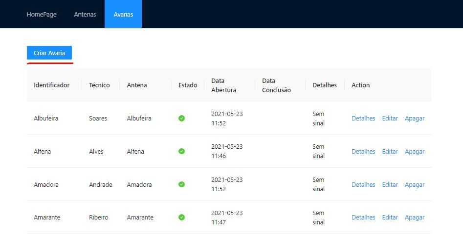
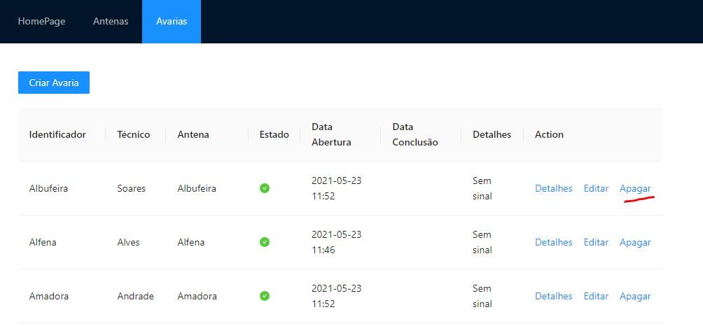
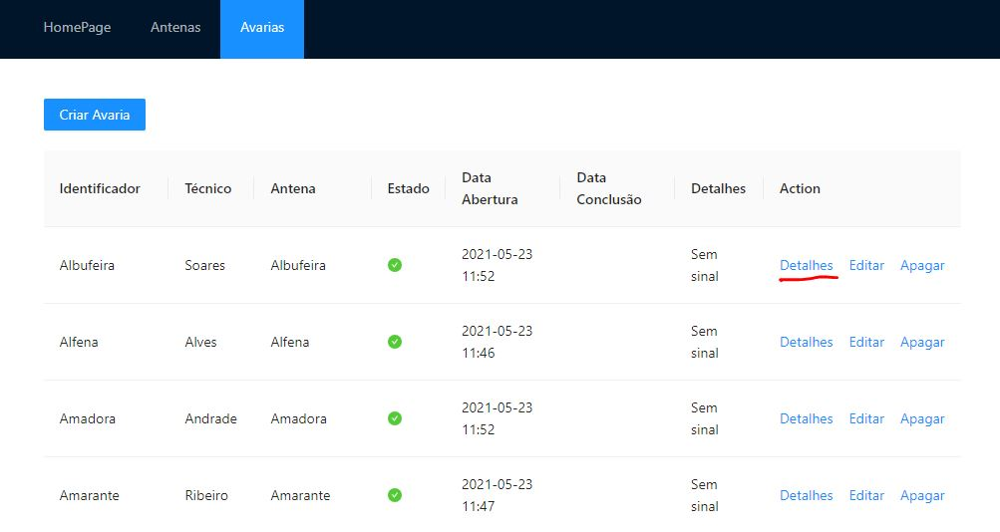
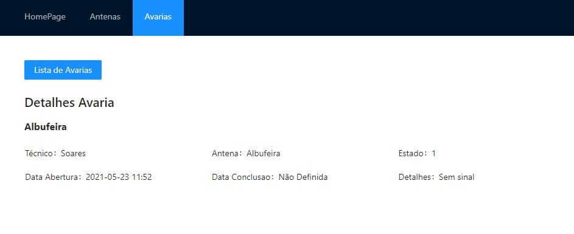

# C2 : Interface de Utilizador

- Página Home
  - Navbar com HomePage, Antenas e Avarias
- Página Antenas
  - Lista por ordem alfabética das antenas criadas.
  - Um botão de criar antena.
    - Botão para voltar à lista de antenas.
    - Três caixas de texto para escrever o nome da antena, a latitute e a longitude.
    - Botão de criar em baixo para criar a antena.
- Página Avarias
  - Lista por ordem alfabética das avarias criadas.
  - Um botão de criar avaria.
    - Botão para voltar à lista de avarias.
    - Duas caixas de texto para escrever o identificador e os detalhes.
    - Duas dropdowns para selecionar o técnino e a antena.
    - Botão de criar em baixo para criar a avaria.

## Interface e recursos comuns

### Esboços

#### _Antes_

##### Home

|                                        |
| :------------------------------------: |
|  |
|             Página Inicial             |

##### Antena

|                                            |                                                      |
| :----------------------------------------: | :--------------------------------------------------: |
|  |  |
|               Página Antena                |                 Criar Página Antena                  |

##### Avaria

|                                            |                                                      |
| :----------------------------------------: | :--------------------------------------------------: |
|  |  |
|               Página Avaria                |                 Criar Página Avaria                  |

#### _Depois_

##### Home

|                                         |
| :-------------------------------------: |
|  |
|             Página Inicial              |

##### Antena

|                                             |                                                       |
| :-----------------------------------------: | :---------------------------------------------------: |
|  |  |
|                Página Antena                |                  Criar Página Antena                  |

##### Avaria

|                                             |                                                       |
| :-----------------------------------------: | :---------------------------------------------------: |
|  |  |
|                Página Avaria                |                  Criar Página Avaria                  |

### Wireframe

**_Antena_**

- _Como criar uma antena_

|                                                  |                                                    |
| :----------------------------------------------: | :------------------------------------------------: |
|  |  |
|        Carregar no botão de criar antena         |  Preencher os campos e carregar no botão de criar  |

- _Como editar uma antena_

|                                                    |                                                      |
| :------------------------------------------------: | :--------------------------------------------------: |
|  |  |
|            Carregar no botão de editar             |    Substituir nos campos e carregar no atualizar     |

- _Como apagar uma antena_

|                                                    |
| :------------------------------------------------: |
|  |
|            Carregar no botão de apagar             |

- _Como ver os detalhes de uma antena_

|                                                      |                                                        |
| :--------------------------------------------------: | :----------------------------------------------------: |
|  |  |
|            Carregar no botão de detalhes             |                   Vista de detalhes                    |

- _Como criar um comentário numa antena_

|                                                        |                                                          |
| :----------------------------------------------------: | :------------------------------------------------------: |
|  |  |
|             Carregar no botão de detalhes              |    Preencher os campos e carregar no criar comentário    |

**_Avaria_**

- _Como criar uma avaria_

|                                                  |                                                    |
| :----------------------------------------------: | :------------------------------------------------: |
|  |  |
|        Carregar no botão de criar avaria         |      Preencher os campos e carregar no criar       |

- _Como editar uma avaria_

|                                                    |                                                      |
| :------------------------------------------------: | :--------------------------------------------------: |
|  |  |
|            Carregar no botão de editar             |    Substituir nos campos e carregar no atualizar     |

- _Como apagar uma avaria_

|                                                    |
| :------------------------------------------------: |
|  |
|            Carregar no botão de apagar             |

- _Como ver os detalhes de uma avaria_

|                                                      |                                                        |
| :--------------------------------------------------: | :----------------------------------------------------: |
|  |  |
|            Carregar no botão de detalhes             |                   Vista de detalhes                    |

### Sitemap

_Na página inicial podemos escolher em qual página entrar (HomePage, Antenas ou Avarias)._

- Página HomePage

  - Mostra o logótipo do software.

- Página Antenas

  - Dentro da página Antenas é mostrada uma lista com todas as antenas criadas e podemos também criar uma nova.
  - Na lista mostrada é possível editar, apagar e ver os detalhes de cada antena.
  - Dentro dos detalhes é possível criar um comentário que ficará guardado e que depois dá para apagar.

- Página Avarias
  - Dentro da página Avarias é mostrada uma lista com todas as avarias criadas e podemos também criar uma nova.
  - Na lista mostrada é possível editar, apagar e ver os detalhes de cada avaria.

---

| [< Previous](c1.md) | [^ Main](https://github.com/gestao-avarias/dispatching-api) | [Next >](c3.md) |
| :------------------ | :---------------------------------------------------------: | --------------: |
