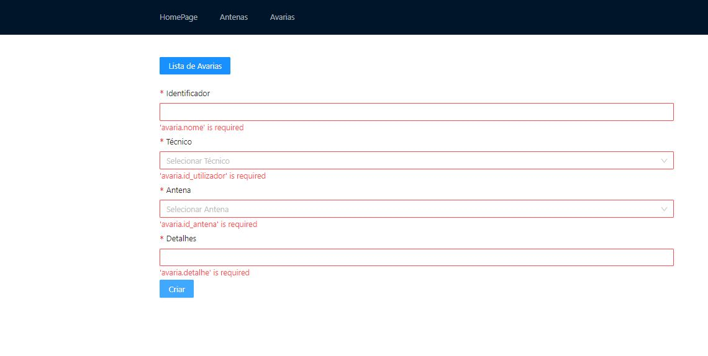

# C3 : Produto

O produto permite o gestor de avarias atribuir tarefas ao técnico, e permite ao técnico consultar as anteas, marcar antenas favoritas e deixar comentários sobre as antenas.

## 3.1 Instalação

Para instalar é preciso entrar na pasta src:

**_Server_**

- $ **cd server/src**
- $ **npm install**
- $ **node index.js**

**_Client_**

- $ **cd view**
- $ **npm install**
- $ **npm start**

## 3.4 Forms

**_Exemplo:_**

|                          |
| :----------------------: |
|  |
|   Campos obrigatórios    |

## 3.6 Detalhes de implementação

[Requisitos](RequisitosPW.pdf)

| [< Previous](c2.md) | [^ Main](https://github.com/gestao-avarias/dispatching-api) | [Next >](c4.md) |
| :------------------ | :---------------------------------------------------------: | --------------: |
